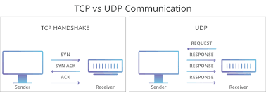

# Networking Feature 

# Resources to help

Provided below are a list of curated resources to help you complete the task(s) below. Consult them (read them, or do ctrl+f for keywords) if you get stuck.

1. For Task 1 - Networking
	- Sockets
		- https://dlang.org/phobos/std_socket.html
	- Sockets Guide 
		- https://beej.us/guide/bgnet/html/split/
	- Another Sockets Guide in C
		- https://www.gnu.org/software/libc/manual/html_node/Sockets.html

# Task 1 - Networking

Previously you have learned how to create a networked application. Now it is time to combine what we have learned in our previous labs/assignments/exercises and build a collaborative painting program.

Our goal is to be able to have multiple clients (at least 3) connect to a server application which will broadcast changes to each user as they paint.

### Design considerations

- Multiple users will be editing different or the same piece of a canvas.
	- Think about how you want to structure 'packets' of data being sent from client to server and vice versa.
	- Think about what data structures you might want to use to store this data.
- If a client leaves, the server should not crash.
- If the server is closed, clients should still be able to paint, but without any other clients modifying the painting.

## Requirements Analysis (Your Task)

1. Integrate previous assignments if you have not previously done so.
	- This tasks main feature is to have a server which multiple clients can connect to collaboratively paint on the same canvas.
		- The IP address and port# should not be hard-coded anywhere in the application. (Prompt the user for input)
		- Note when a new user joins, they should receive the same canvas that other clients are painting on. Think about where you should store the command history or pixel information for the canvas.
		- At least 3 users should be able to paint at once.
		- When a client joins later, they should have the entire history of previous commands available to them.
		- Clients can undo/redo other clients actions.
2. Integrate the following labs
	- From your lab you should have a GUI window where you can change colors that you draw in
	- From your lab you should have a networked application.

### Advice

Start small, slowly integrate the features into your assignment.

### Deliverables

- A client/server where users can paint.

# F.A.Q. (Instructor Anticipated Questions)

1. Q: How do we handle undo?
	- A: Undo should undo the last command a user did and send that action to the server. Note, that if a user paints on top of a pixel that you are undoing the operation on, your change will override their change. This is fine behavior.
2. Q: Can I change this to be a peer-peer application or otherwise change the structure of the networked code?
	- A: Sure, so long as at least 3 clients can paint at the same time.
3. Q: Does your instructor enjoy painting?
	- A: Yes, but I am not very good. The following below is a recent experiment of something called a Dutch Pour. You use a hair dryer and a blow torch over acrylic paints.
	- 

