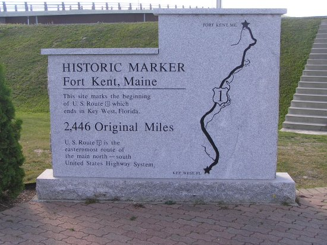

# Milestone Check-in #1

## Milestone Check-in with your Project Manager

A [software project manager](https://www.wrike.com/project-management-guide/faq/what-is-software-project-management/) (PM) is someone who takes on the role of organizing a software project and managing the day-to-day operations of a project. They are in charge of the project planning (e.g. assigning tasks to the engineers and prioritizing the tasks) and making sure the project moves forward as intended.

In this course, our project managers (the course staff) will help guide you to make sure you are on track. You will be required within two weeks (see [milestones](./../) for specific deadline) to check in with your Project Manager. This can/will be a virtual meeting. 

Provided below are the requirements which the project managers will ask you. For items that you have completed, there will be no further discussion. For items that are not completed, you should discuss a game plan of how you will prioritize and complete that task.

## Milestone ("Sprint") Check list

**Note**: Everyone needs to speak at this meeting.

- [ ] Did you come up with a plan/timeline for features? (Milestone 0)
- [ ] How is (or how did) the integration of all the assignments go?
	- What lessons did you learn? (if any)
- [ ] Have you implemented any software development methodology?
- [ ] How has team member communication been thus far?
- [ ] What is each teammate currently working on?
	- How long do you expect that feature to take? Do you think this feature is a priority and may block others from making progress? If so, would you consider pair programming?
- [ ] Is there a team member who feels confident in using Git, such that they can troubleshoot version control bugs?
	- Is everyone working on the main branch, or are you all working on separate branches and merging?
- [ ] Are you using good abstractions in your code? (i.e. avoiding large chunks of code)
- [ ] Do you have a dub.json?
- [ ] What feature is the team thinking about adding to the project?
- [ ] Are you using tools that we have learned about like unit-threaded and continuous integration?
	- Have you thought about integrating these tools into your build system?
- [ ] Any other questions/concerns/things blocking you from making progress?

