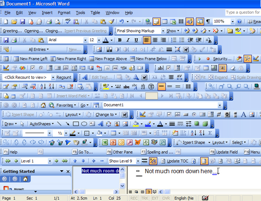

# Extra Feature

For your paint program, you now get to take some control of the direction of the project. Most teams may opt to implement different features, but the only requirement is that you implement at least one significant feature to impress our client. Why only one? You are certainly welcome to add more, but be careful given the tight project timeline! Adding too many features can sometimes lead to something called [feature creep](https://en.wikipedia.org/wiki/Feature_creep), where you add many features to appease your client, but they may not actually need many features, only 1 or 2 that work really well!

## Feature List

Below is a prospective list of features which you may choose from to add. Decide as a group which feature you would like to add.

- Features of your choice
	- **Networked Chat**
	- **At least 3 different Paint brushes (ideally implemented in an 'intelligent way' or with a design pattern)**
	- At least 3 different image filters that can be applied
	- At least 3 different tools for manipulating the canvas (e.g. selection, eraser, blur)
	- Real-time Video of each client
	- **A file compression algorithm for saving your sketch**, and one for loading your sketch when the server starts
	- Implement a client, so you can paint on another device (e.g. iOS or Android)
	- Any other features you otherwise would like to propose, which must go through your project manager (See F.A.Q)
	- **Cool CSS skins on mac and linux builds**
	- **About page for the application**

### Feature Use Case

Your next task is the following.

1. Make sure your extra feature to your project timeline
2. Add the feature to the 'Projects' task list in GitHub. You may break it down into further sub-tasks as needed.
3. Begin implementing the feature.
	- You must also implement at least 1 test case for your feature to ensure that it works.

# F.A.Q. (Instructor Anticipated Questions)

1. Q: If I choose a really easy feature will I get less points?
	- A: Not necessarily, and I think each feature has its own challenge.
2. Q: If I implement 2 or more features will I get more points?
	- A: I would encourage that, maybe! But 1 good feature that works is better than 2 features which almost work.
3. Q: Can I propose another feature?
  	- A: Sure, do so with your project manager, and they will approve it based on if they think it can be completed by the project deadline.

