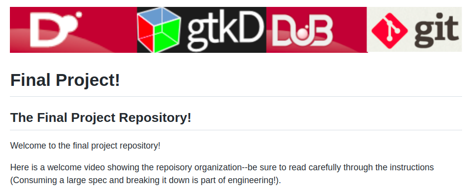

# Final Project!

## The Final Project Repository!

Welcome to the final project repository!  

Here is a welcome video showing the repository organization--be sure to read carefully through the instructions (Consuming a large spec and breaking it down is part of engineering!).

https://youtu.be/F0XVOL1zQHM

## Repository Organization 

1. There are no more individual assignments.
2. You will complete your final project in the [final project directory](./FinalProject). The organization is partially up to you on the file structure and organization, just make sure you organize it logically and against any requirements.

## Team

**Team Name**: DRaw

**Team Member Names**:

1. Steven Abbott
2. Elizabeth Williams
3. Andrew Briasco-Stewart
4. Ben Mallett

# Team Spreadsheet 

- Your team members and project manager are listed on the following spreadsheet [here](https://docs.google.com/spreadsheets/d/1Z81Es6K-AAlTdzFNmQA32MbcQVekF6jEHnhKCKACF2w/edit?usp=sharing). 
- Your project manager will be your first point of contact for various project deliverables and questions. Though you may continue to attend office hours with whomever you like, your project manager will be your primary contact.

## Team Logistics

- Work with your team to ensure everyone has a way to work on this codebase with a common set of tools
- Everyone should make code contributions to the repository (i.e. everyone should have some commits in the commit history -- even if you pair program, that means you need to switch who is in control!)
- See the project timeline
- Note: In semesters where I have a 'token system' for late days, **you cannot use any tokens** for the final project

## Notes on working in teams

* [Four Ways to Lead Your Software Team to Success](https://hackernoon.com/four-ways-to-lead-software-team-to-success-43fa156719b4)
* [The 3 C's of being a captain](https://appliedsportpsych.org/resources/resources-for-athletes/the-3-c-s-of-being-a-captain/)
* [Etiquette for Pair Programming](https://dzone.com/articles/etiquette-for-pair-programming)

# Rubric
 
<table>
	<tbody>
		<tr>
			<th>Points</th>
			<th align="center">Description</th>
			</tr>
			<tr>	  
			<td>10% (Milestone Check-in #1)</td>
				<td align="left">
					<ul><li>Did you complete your check-in #1?</li><li>Was a timeline present?</li><li>Were there at least 10 tasks created in the 'Projects' tab?</li></ul>
				</td>
		</tr>
	</tbody>
</table>

<table>
	<tbody>
		<tr>
			<th>Points</th>
			<th align="center">Description</th>
			</tr>
			<tr>	  
			<td>10% (Milestone Check-in #2)</td>
			<td align="left">
				<ul><li>Did you complete your check-in #2?</li>
			</td>
		</tr>
	</tbody>
</table>

<table>
	<tbody>
		<tr>
			<th>Points</th>
			<th align="center">Description</th>
			</tr>
			<tr>	  
			<td>5% (Youtube Video)</td>
			<td align="left">
				<ul><li>Did you upload a YouTube Video and test out opening it incognito mode, so we could also access it?</li>
			</td>
		</tr>
	</tbody>
</table>

<table>
  <tbody>
    <tr>
      <th>Points</th>
      <th align="center">Description</th>
    </tr>
     <tr>
	<td>10% (Team Assessment)</td>
	<td align="left"><ul><li>Did you complete the assessment form which earns you 2%? -- the other 8% is determined by your team members responses.</li><li>Note: In rare instances the instructor reserves the right to weigh the Team assessment more heavily. In the instance that a team member scores very low, the instructor will individually evaluate that students grade for the project.</li></ul></td>
    </tr>	     
  </tbody>
</table>  

<table>
  <tbody>
    <tr>
      <th>Points</th>
      <th align="center">Description</th>
    </tr>
     <tr>
	<td>25% (Polish and completion)</td>
	<td align="left"><ul><li>How polished are your materials (timeline, documentation, presentation)? Does your software work? Does it compile? Does it crash, segfault?</li></ul></td>
    </tr>	     
  </tbody>
</table>  

<table>
  <tbody>
    <tr>
      <th>Points</th>
      <th align="center">Description</th>
    </tr>	     
      <td>10% (Feature of your choice)</td>
	<td align="left"><ul><li>Does your feature work? Do you have at least 1 test case?</li></ul></td> 
    </tr>
  </tbody>
</table>

<table>
  <tbody>
    <tr>
      <th>Points</th>
      <th align="center">Description</th>
    </tr>	     
      <td>20% (Networking)</td>
	<td align="left"><ul><li>Does your networking work?</li></ul></td> 
    </tr>
  </tbody>
</table>

<table>
  <tbody>
    <tr>
      <th>Points</th>
      <th align="center">Description</th>
    </tr>	     
      <td>10% (Testing)</td>
	<td align="left"><ul><li>Do you have at least 8 unit test cases? Are they properly integrated with a GitHub Action?</li></ul></td> 
    </tr>
  </tbody>
</table>

**Note:** To be 100% clear, every team member gets the same grade except for the peer assessment.
